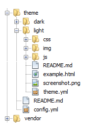

#Glance

###Themes manager for APPs in PHP

##Why use?


With a manager of themes you can separate your
styles (as CSS, JS, images among others) in your
web application, without worrying many about
changes in the URIs in your template file
(as .tpl, .html, .phtml among others).

For example, to get files of style, you use only:

    $theme->css("custom.css");

or all CSSs.
    
    $theme->css();


[See several examples](#methods) or [see one Demo](https://github.com/roggeo/demo-glance)


##Install

* 1) Run the commands:

```bash
$ mkdir your_project
$ cd your_project
$ php -r "readfile('https://getcomposer.org/installer');" | php
```

* 2) Create a file **your_project/composer.json** with the following content:
    
```json 
{
    "require": {
        "roggeo/glance": "dev-master"
    }
}
```

* 3) Run the commands:

```bash
$ php composer.phar update
```


Or simply (if you have installed Composer) run the following commands
in your application folder:

```bash
$ mkdir your_project
$ cd your_project
$ composer require roggeo/glance:dev-master
```


##How use?


* 1) Create a file **your-folder-themes/config.yml**:

```yml
# Name of the themes, if enabled tell true
themes:
    "sometheme1":
    "sometheme2":
    "sometheme3": true
    "sometheme4":
``` 


* 2) Create a file **your-folder-themes/your-theme/theme.yml**:

```yml
#Information of a specific theme
theme  : Litht
author : Geovani
email  : name@email.com
date   : 2015-11-08
license: http://opensource.org/licenses/MIT
link   : https://yoursite.com
description: >
    Theme default for Glance
```


* 3) Your repository themes should have a basic structure, such as:
theme (folder to save all themes), light (a theme sample) and light files
that is the basic structure of a theme for Glance. See a image:

[](#)


* 4) Create a file **public/theme/index.php**, and insert the code:

```php
require_once __DIR__.'/../../vendor/autoload.php';
use Glance\Response;
Response::listenMessage();
```


* 5) Create a file **public/theme/.htaccess**, and insert the code:

```sh
<IfModule mod_rewrite.c>
RewriteEngine On
RewriteCond %{REQUEST_FILENAME} !-f
RewriteCond %{REQUEST_FILENAME} !-d
RewriteRule ^(.*)$ index.php?get=$1 [L]
</IfModule>
```


##Instructions for themes Glance

[Theme](https://github.com/roggeo/light), see example of one.

[Demo](https://github.com/roggeo/demo-glance), see how to use.


##Methods

```php

...
//code configuration
...


//images
$theme->img("name-image", "png");
$theme->img(array("image-1","image-2"), "png");
$theme->img("name-image.jpg");


//css
$theme->css("custon.css");
$theme->css(array("custon", "main"));
$theme->css(array("custon.css", "main"));
$theme->css();


//javascript
$theme->js("custon.js");
$theme->js(array("custon", "main"));
$theme->js(array("custon.js", "main"));
$theme->js();


//Call files of another Theme
$theme->css('side','dark');
$theme->js('home', 'dark');
$theme->img('book','png','dark');
$theme->enqueue('img/book.png','dark');


//All
$theme->enqueue('image.png');
$theme->assets('style.css','bootstrap');


```

##In your web page

Create a index.php at the root of your project with the following content:

```php
<?php
include "vendor/autoload.php";

use Glance\Glance,
    Glance\Config;

$conf = new Config();

// Defining folder repository of all yours themes
$conf->setFolderTheme('C:\\themes');

$theme = new Glance($conf);

?>

<html>
    <head>
        <title>Theme Light</title>
        <meta charset="UTF-8">
	<?php $theme->css();?>
        <meta name="viewport" content="width=device-width, initial-scale=1.0">
    </head>
    <body>
        <div>Theme Light default Glance</div>
        <?=$theme->enqueue('img/light.jpg')?>
        <br />
        <br />
        <?=$theme->img('light.jpg')?>
        <br />
        Or
        <br />
        <?=$theme->img('light')?>
        <br />
        <br />
        <br />
        <?php
        foreach($theme->img(array("books1","books2"), "png") as $book):            
            echo "$book<br/>";            
        endforeach;        
        ?>
        <?=$theme->js('light')?>
        
        <div>
            <p>Other theme</p>
            <ul>
                <li><?=$theme->css('side','dark')?></li>
                <li><?=$theme->js('home')?></li>
                <li><?=$theme->img('book','png','dark')?></li>
                <li><?=$theme->enqueue('img/book.png','dark')?></li>
            </ul>
            <?php
            foreach ($theme->enqueue(array('img/book.png'), 'dark') as $book):
                echo "$book<br/>";
            endforeach;
            ?>
            
        </div>
        <div>
            <?php echo $theme->img('books1')?>
            <br/>
            <?php echo $theme->assets('style.css','bootstrap')?>
        </div>
        
    </body>
</html>

```

##Tests

For tests use PHPUnit after to use the recommendations above with Composer:

[More details PHPUnit](https://phpunit.de)

```bash
    $ cd you_project/vendor/roggeo/glance
    $ phpunit
```


##Contributing

If case of your interest, you can help improve this project.
See how:

- [Contribuing](CONTRIBUTING.md)


##License
- [License](LICENSE.md)